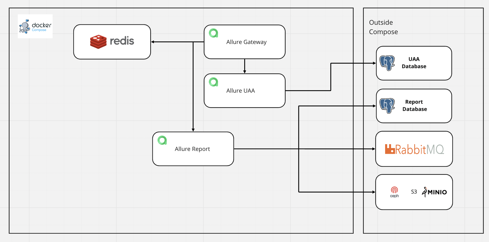

# This repository is OUTDATED and mustn't be used for the deployment of Allure TestOps

[Use documentation pages instead](https://docs.qameta.io/allure-testops/install/docker-compose/)

# Docker Compose Deployment

Old compose repo is deprecated and moved to [Legacy](testops-legacy) do not use it. Please.



## For Fresh Production Install

1. Get 2 Postgres (ver >= 12) databases for uaa and report (NOT ON THE SAME SERVER with TESTOPS). You can get SAAS Databases from your cloud provider. Amazon AuroraDB is also supported. If you have everything self-hosted, get one from [Official Postgres Vendor](https://www.postgresql.org/download/)
2. Install [RabbitMQ](https://www.rabbitmq.com/download.html) on SEPARATE Server.
3. Install [Minio](https://docs.min.io/docs/minio-quickstart-guide.html) on SEPARATE Server. (If you have AWS S3 or Ceph, skip this step)
4. Install Docker:

```shell
curl -fsSL https://get.docker.com -o get-docker.sh
chmod +x get-docker.sh
./get-docker.sh
```
5. ```mkdir -p /opt/allure-testops```
6. ```cp testops/docker-compose.yml /opt/allure-testops/```
7. ```cp testops/env-example /opt/allure-testops/.env```
8. Edit ```/opt/allure-testops/.env``` with your favourite text editor.
9. ```cd /opt/allure-testops/```
10. ```docker compose up -d```
11. Set your LoadBalancer to proxy traffic to 8080 port (Gateway)

If you want TestOps to use SSO, copy testops-{auth} instead on steps 6-7, for example NOT testops but testops-ldap
For ENV reference please watch [References](extras/env-references.md)

## For Fresh Demo Install

This Kind of installation is NOT PRODUCTION GRADE. Use it only for testing. In case you lose data, please don't blame us. There is nothing we can do in this case.

1. Install Docker:

```shell
curl -fsSL https://get.docker.com -o get-docker.sh
chmod +x get-docker.sh
./get-docker.sh
```

2. ```mkdir -p /opt/allure-testops```
3. ```cp testops-demo/docker-compose.yml /opt/allure-testops/```
4. ```cp testops-demo/env-example /opt/allure-testops/.env```
5. Edit ```/opt/allure-testops/.env``` with your favourite text editor.
6. ```cd /opt/allure-testops/```
7. ```docker compose up -d```
8. Set your LoadBalancer to proxy traffic to 8080 port (Gateway)

## Lego Approach
This may help you to migrate to production grade deployment

- [Metrics](extras/metrics.md)
- [Databases](extras/Databases.MD)
- [Minio](extras/minio.md) (Migration Scripts Present)
- [RabbitMQ](extras/rabbitmq.md)


## Release notes

### 2023-06-13 We have added SMTP integration parameters for adding new members and password reset functionality.

To enable Allure TestOps to send email notifications to new team members and for password reset, you need to add environment variables to the UAA service settings.

The environment variables for SMTP configuration in Allure TestOps are named with the prefix "SPRING_MAIL_".

### 2022-11-03 For forthcoming releases we've added ALLURE_JWT_SECRET to allure report, uaa

When using releases after 4.9.2 (excluding it) all the services will require ALLURE_JWT_SECRET to start.

ALLURE_JWT_SECRET should be the same for all the services, i.e. to be set via `.env`
